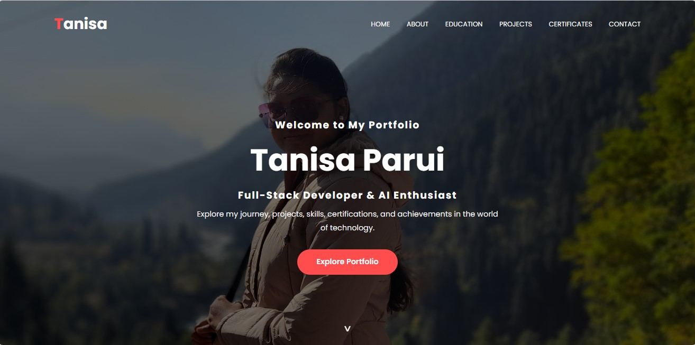
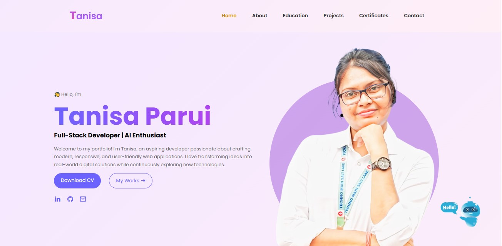
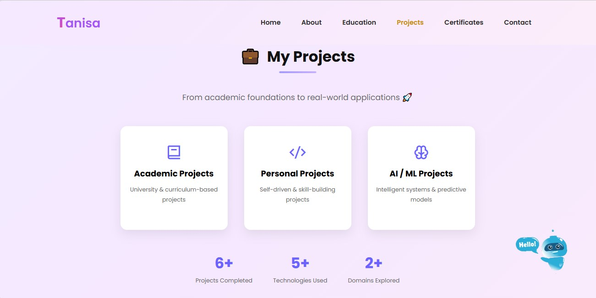
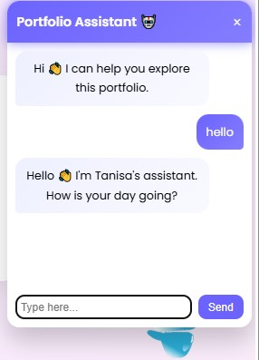

# 🌐 Tanisa - Personal Portfolio Website

A modern and fully responsive personal portfolio website showcasing my skills, projects, certifications, and achievements.

## 📸 Screenshots

### Starting Page

### Home Page

### Projects Section

### AI Chatbot

  
  

## ✨ Features

- Responsive Design
- AI-powered Portfolio Chatbot
- Project Showcase
- Certificates Section
- Contact Form
- Smooth Animations

## 🛠️ Technologies Used

- HTML5
- CSS3
- JavaScript
- Git
- GitHub

## 📂 Project Structure

- Home
- About
- Education
- Projects
- Certificates
- Contact

## 🚀 Live Demo

[View Portfolio Website](https://tanisa-2003.github.io/Tanisa/)

## 👩‍💻 Author

**Tanisa Parui**